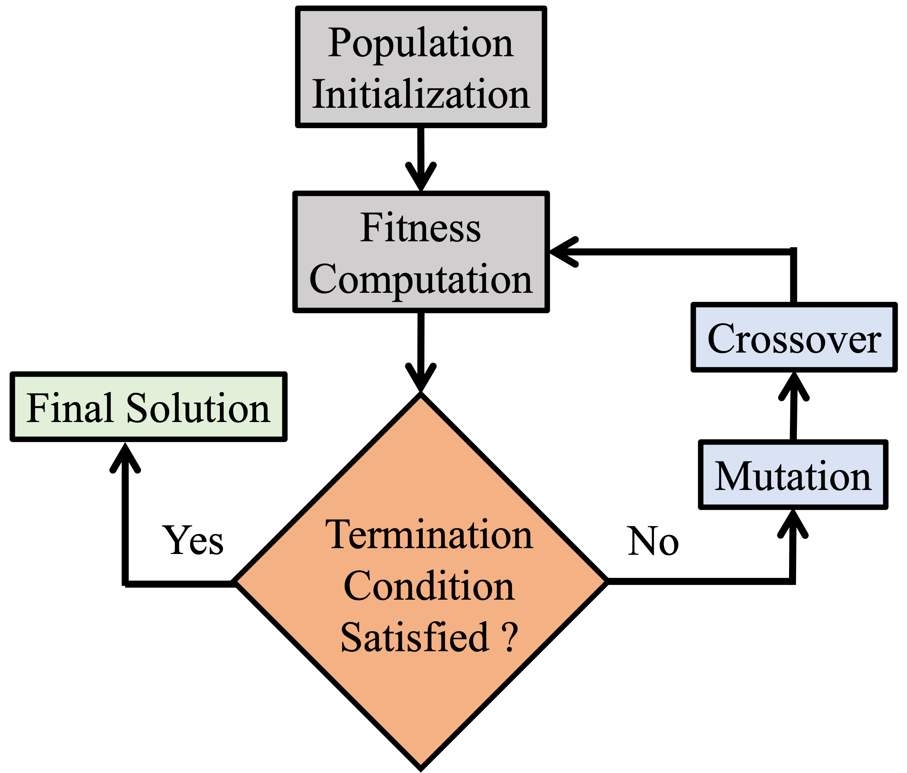
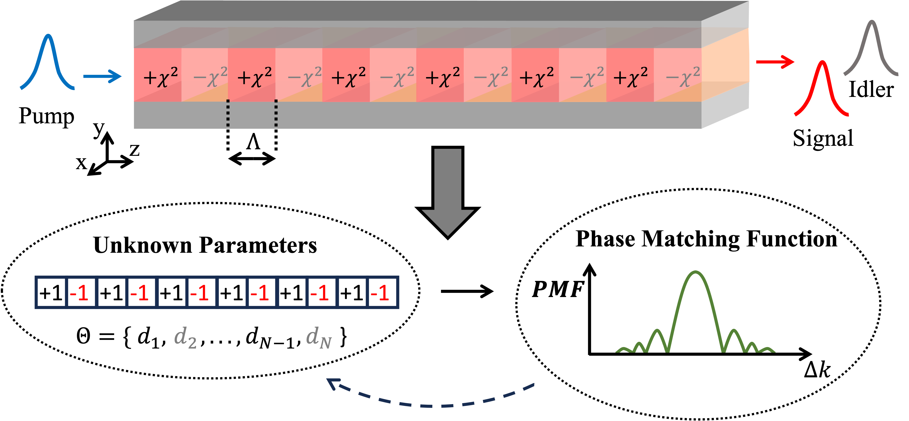
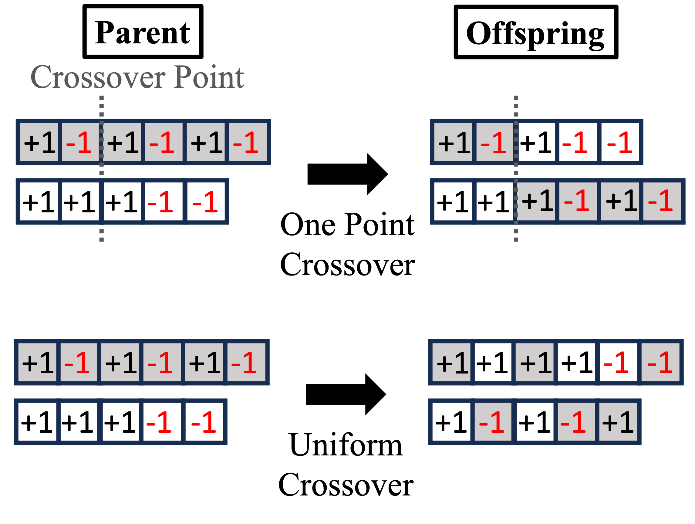

# PNF Optimization

This repository contains code for optimizing second-order nonlinear materials to develop bright and broadband entangled photon sources. The project leverages genetic algorithms to optimize the phase-matching function (PMF) of nonlinear crystals, crucial for enhancing the performance of quantum light sources used in applications like quantum imaging and metrology.

## Overview

This project focuses on optimizing the nonlinear profiles of crystals segmented into domains, each with an orientation of +1 or -1. The goal is to find the optimal configuration that aligns with a target PMF. The challenge lies in navigating the large, non-convex solution space to minimize the Mean Squared Error (MSE) between the computed and target PMFs.

## Theoretical Background

### Phase-Matching Function Optimization

In the context of second-order nonlinear optics, the phase-matching function (PMF) plays a critical role in determining the efficiency and spectral properties of processes like Spontaneous Parametric Down-Conversion (SPDC) and Second Harmonic Generation (SHG). The PMF can be derived from the crystal's nonlinear profile, which is modeled as a series of domains with alternating nonlinear coefficients.

Each domain configuration corresponds to a specific PMF, which can be expressed mathematically as:

$$
\Phi(\Delta k) = \int_{-L/2}^{L/2} g(z) e^{i \Delta k (\omega_s, \omega_i)} dz,
$$

where $L$ is the length of the crystal, $\Delta k (\omega_s, \omega_i) = k_p(\omega_s + \omega_i) - k_s(\omega_s) - k_i(\omega_i)$ is the phase mismatch, and $g(z) \in \{-1, +1\}$ represents the nonlinear profile along the propagation direction $z$.

The objective is to minimize the difference between the calculated PMF and a target PMF $\Phi_t(\Delta k)$ using the Mean Squared Error (MSE):

$$
\text{MSE}_{\text{pmf}} = \sum_{n=1}^M \frac{(\Phi (\Delta k_n) - \Phi_t (\Delta k_n))^2}{M},
$$

where $M$ is the number of sampled points in the phase mismatch range.

### Genetic Algorithm for PMF Optimization

To address this optimization problem, we employ a genetic algorithm, which is inspired by the process of natural evolution. The algorithm iteratively improves a population of possible solutions by applying operations such as selection, crossover, and mutation.

#### Algorithm Flow

1. **Population Initialization**: A population of potential solutions (crystal configurations) is randomly generated.
2. **Fitness Computation**: The fitness of each configuration is evaluated based on the MSE between the computed and target PMFs.
3. **Selection**: Configurations with better fitness are more likely to be selected for reproduction.
4. **Crossover**: Pairs of configurations are combined to produce offspring with mixed features from both parents.
5. **Mutation**: Random changes are introduced to some configurations to explore new areas of the solution space.
6. **Termination**: The algorithm repeats the process until a termination condition is met, such as reaching a maximum number of generations or achieving a satisfactory fitness level.

Below is a visual representation of the genetic algorithm process:



### Crystal Nonlinear Profile and PMF

The crystal's nonlinear profile is represented by a series of domains, each with an orientation of either +1 or -1. The genetic algorithm manipulates these orientations to optimize the PMF.

The figure below illustrates the relationship between the crystal's domain configuration and the resulting PMF:



### Crossover Operation in the Genetic Algorithm

Crossover is a key operation in the genetic algorithm, where two parent configurations are combined to produce offspring. The crossover point is randomly selected, and portions of the parents' configurations are swapped to create new solutions.

The following figure demonstrates the crossover operation:



## Installation

Clone the repository and install the required dependencies:

```bash
git clone https://github.com/yourusername/PNF-Optimization.git
cd PNF-Optimization
pip install -r requirements.txt
